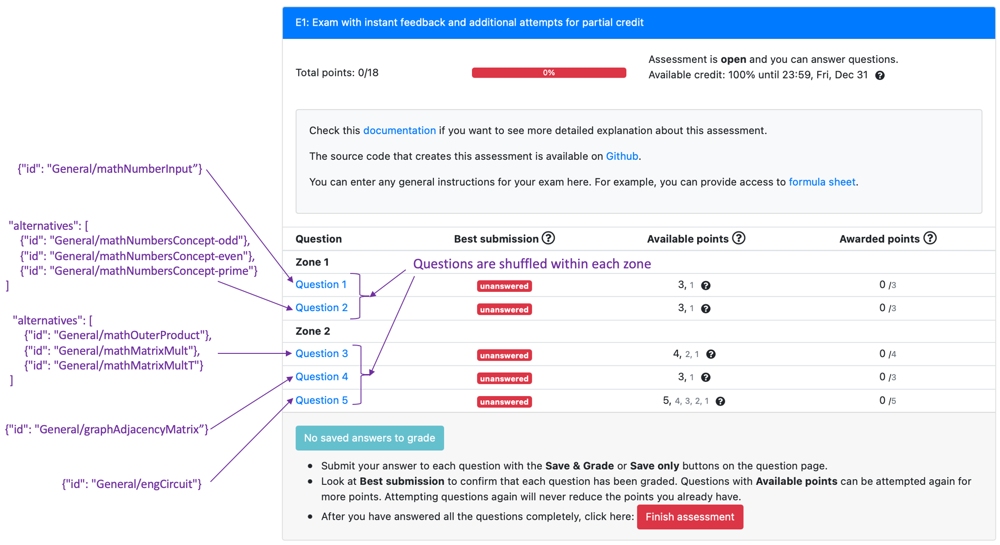
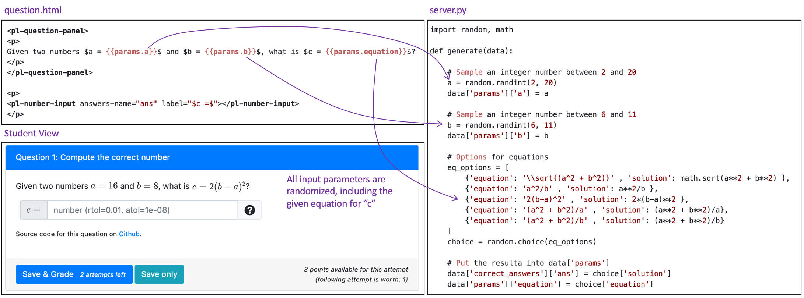
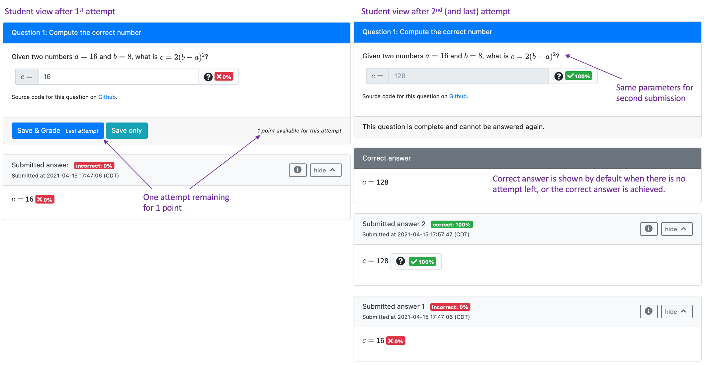
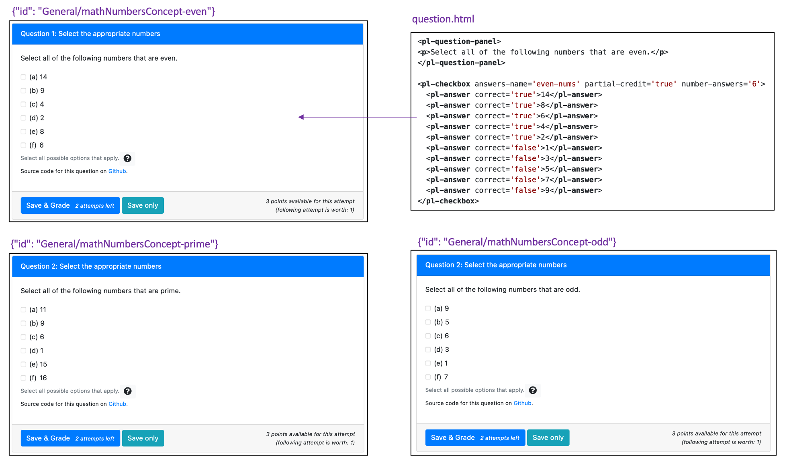
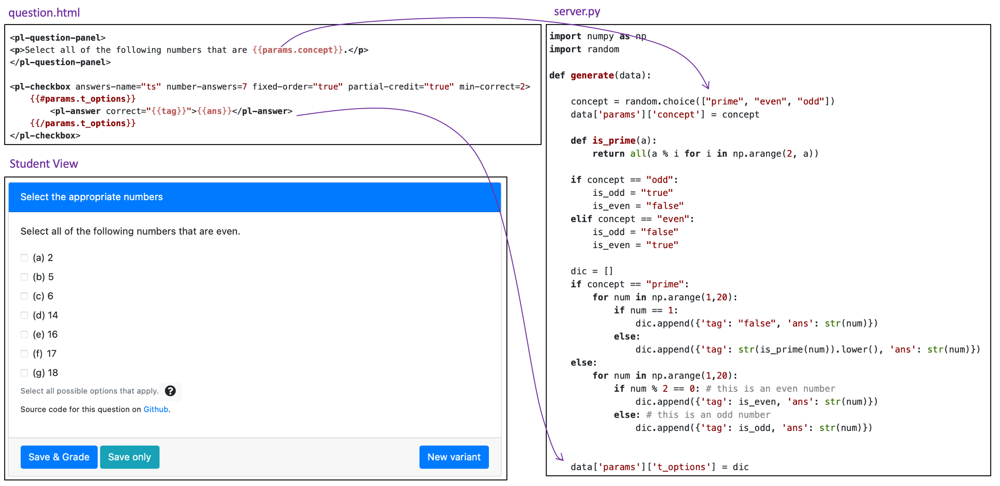

## Exam/Quiz with instant feedback and retry attempt for partial credit

This assessment provides an example of how we can use PrairieLearn to deliver exams that are distinct for each student, auto-graded with instant feedback, and with opportunity for retry attempts for partial credit.

This example uses `"type": "Exam"` in the assessment configuration file. The example source code is available on [Github](https://github.com/PrairieLearn/pl-demo-course/blob/master/courseInstances/SectionA/assessments/01-ExamInstantFeedback/infoAssessment.json).

When using `"type": "Exam"`, one can define an assessment question by either a single `id` or by a list of alternatives. In the example below, the assessment `Question 1` is set by a single `"id": "General/mathNumberInput"`, while `Question 2` is randomly selected from a pool of three different questions. 



Each zone will appear in order in the assessment. The zone titles are optional and will be displayed to students when present. The questions are shuffled within each zone. You can find more information about question specification from the [documentation](https://prairielearn.readthedocs.io/en/latest/assessment/#question-specification).

All question instances are generated only once when the exam instance is created for that student. This is different than `"type": "Homework"`
where students are able to create new question instances for practice, or for additional points. This feature matches a traditional paper-and-pencil experience, where the student receives one exam with fixed parameters. By default, PrairieLearn will auto-grade each question in real-time, and provide student with the feedback about correctness. Depending on how instructors define the question points, students can try to fix incorrect answers, and submit other attempts for reduced credit. For this example, students that submit question 1 incorrectly in the first attempt are able to still get 1/3 points if they submit the second attempt correct. 


### Question 1:

In this example assessment, question 1 is added to the configuration file [(infoAssessment.json)](https://github.com/PrairieLearn/pl-demo-course/blob/master/courseInstances/SectionA/assessments/01-ExamInstantFeedback/infoAssessment.json) using the following syntax:

```json
{"id": "General/mathNumberInput","points": [3,1]}
```

Note that `points` is now defined by the list `[3,1]`, indicating that students will receive 3 points if they answer the question correctly in the first attempt, and 1 point if they answer the question correctly in the second attempt.

Although this question variant is generated from the same question `id` for all students, the high level of randomization of the question provides enough variation such that not all students are receiving the same problem. Note that all input parameters are generated at random, including the symbolic equation that needs to be evaluated.



If a student submits the first attempt incorrect, they receive immediate feedback, have access to the history of past submissions, and can try to submit new attempts **for the same parameters** for reduced credit.





### Question 2:

In this example assessment, question 2 is added to the configuration file [(infoAssessment.json)](https://github.com/PrairieLearn/pl-demo-course/blob/master/courseInstances/SectionA/assessments/01-ExamInstantFeedback/infoAssessment.json) using the following syntax:

```json
{
    "numberChoose": 1,
    "points": [3,1],
    "alternatives": [
        {"id": "General/mathNumbersConcept-odd"},
        {"id": "General/mathNumbersConcept-even"},
        {"id": "General/mathNumbersConcept-prime"}
    ]
}
```

The question is selected from a list of three alternatives, which are questions without randomization covering similar content, the understanding of odd, even and prime numbers, as illustrated in the figure below. 



One of the advantages of keeping similar question variants with separate question ids is the easy access to statistics. However, using randomization to create question variants inside the same question id can be very useful for bookkeeping. One could combine the three questions above as one, as illustrate in the figure below (this question was included in the homework assessment).



