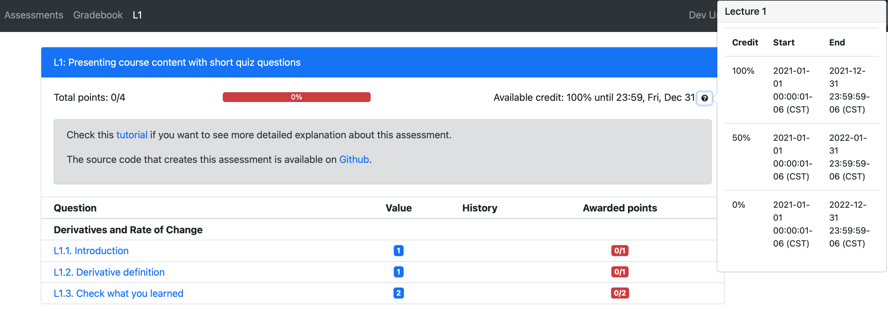
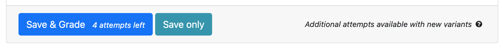
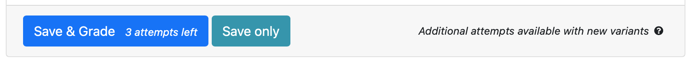
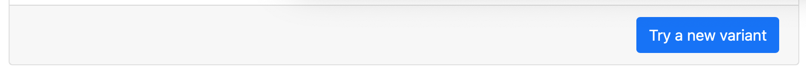
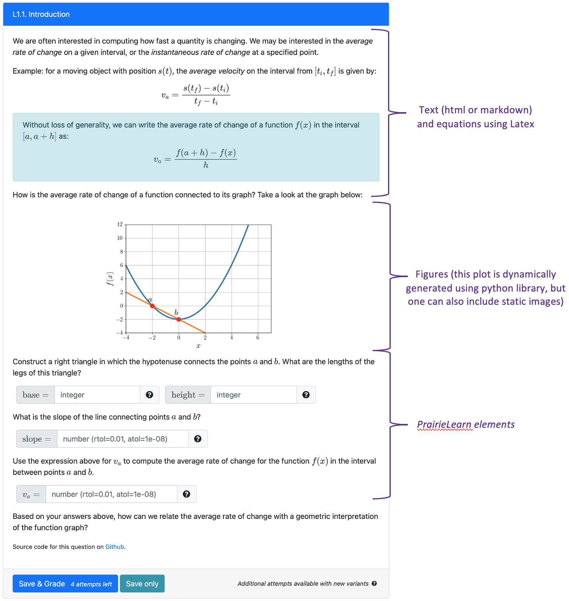
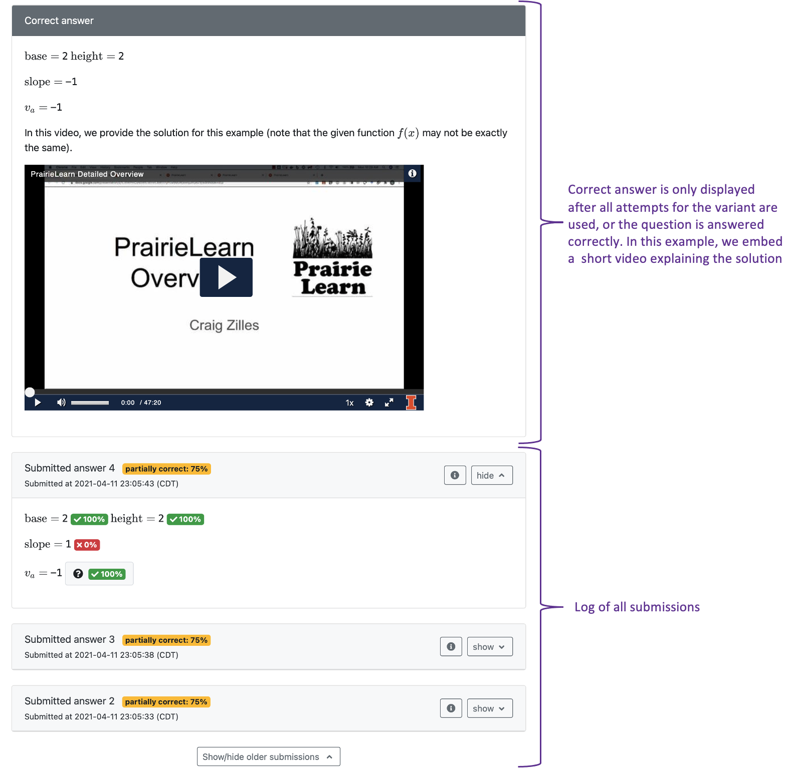
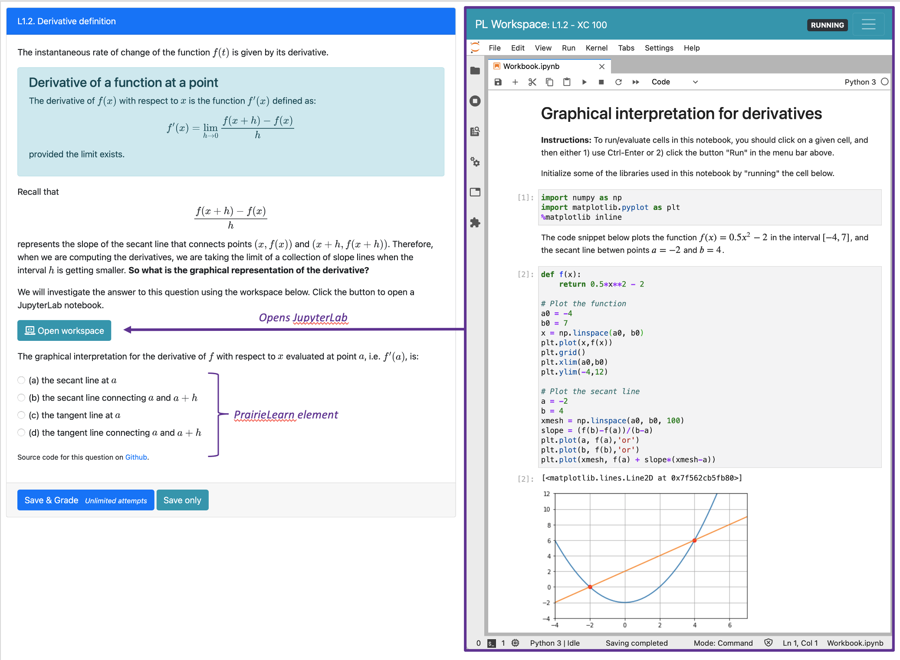
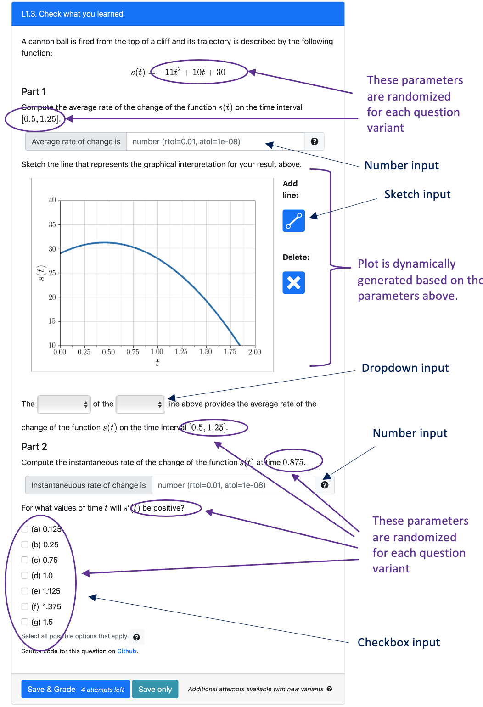

## Creating assessments with lecture content and short quizzes

This assessment provides an example of how we can use PrairieLearn to introduce course content, using a combination of text, figures, embedded videos, interactive JupyterLabs and short questions. 



In this page, we will provide detailed information about the assessment file and each individual question:

- [Assessment L1](#Assessment-L1)
- [Question L1.1. Introduction](#Question-L1.1.-Introduction)
- [Question L1.2. Derivative definition](#Question-L1.2-Derivative-definition)
- [Question L1.3. Check what you learned](#Question-L1.3.-Check-what-you-learned)

### Assessment L1


#### Access rules

In this example, we define three different intervals in which students will have access to this assessment: one deadline for 100% credit, a late deadline for 50% credit, and another deadline (typically at the end of the term) where students can continue to view and submit answers without earning additional credit. You can obtain the complete file that generates the assessment [here](https://github.com/PrairieLearn/pl-demo-course/tree/master/courseInstances/SectionA/assessments/03-LectureContent). 


```json
{
    "comment": "Set end date for 100% credit",
    "mode": "Public",
    "credit": 100,
    "startDate": "2021-01-01T00:00:01",
    "endDate": "2021-12-31T23:59:59"
},
{
   "comment": "Set later end date for reduced credit",
   "mode": "Public",
   "credit": 50,
   "startDate": "2021-01-01T00:00:01",
   "endDate": "2022-01-31T23:59:59"
},
{
  "comment": "Set another end date, potentially end of the term, for zero credit (can practice, but no longer earn points for the assessement)",
  "mode": "Public",
  "credit": 0,
  "startDate": "2021-01-01T00:00:01",
  "endDate": "2022-12-31T23:59:59"
}
```


#### Question points

The first two questions are worth 1 point each, and the third question is worth 2 points. Students will get 100% credit for this assessment upon completion of all questions.

```json
"questions": [
    { "id": "LectureVelocity/1-Introduction", "points": 1, "triesPerVariant": 4},
    { "id": "LectureVelocity/2-Derivative", "points": 1},
    { "id": "LectureVelocity/4-KnowledgeTest", "points": 2, "triesPerVariant": 4}
]
```

Students can attempt to solve these questions for an unlimited number of variants. In general, question variants may be presented using different input values, parameters and other settings. Using the configuration above, when solving the first and third questions, students will be able to submit attempts for the same question up to 4 times. After the last attempt, they will be able to generate another variant of the question. The image below shows the `Save & Grade` button for the questions 1 and 3 once a new variant is created.



After one incorrect attempt, they will have 3 attempts left.



If they use all the attempts, they will be able to generate a new variant. They are also able to generate a new variant if they get the correct answer, and get more practice repeating the question for different parameters.




When solving the second question, students only have one try per variant (the default value), but then can still generate as many question variants as they want.


### Question L1.1. Introduction

The first question highlights how we can use a mixture of html text, latex equations and videos to introduce new content to students. 



When more then one attempt can be made for the same question variant, students have access to a log of the previous submissions. Once the last submission is reached (or the answer is submitted correctly), the correct answer is displayed to students. In this example, we also add an embedded video with the question solution. 



[Source code on Github](https://github.com/PrairieLearn/pl-demo-course/tree/master/questions/LectureVelocity/1-Introduction)

### Question L1.2 Derivative definition

In this second question, we use a JupyterLab notebook for an interactive example to support another new concept. Students need to answer a simple multiple-choice question to test their understanding of the notebook.



[Source code on Github](https://github.com/PrairieLearn/pl-demo-course/tree/master/questions/LectureVelocity/2-Derivative)

### Question L1.3 Derivative definition

The last question includes one example that summarizes the concepts introduced in the previous questions, including different question input such as fill-in-the-blank, checkbox, dropdown and a sketching canvas. Note that the parameters of the question are randomized for each question variant. 



[Source code on Github](https://github.com/PrairieLearn/pl-demo-course/tree/master/questions/LectureVelocity/4-KnowledgeTest)