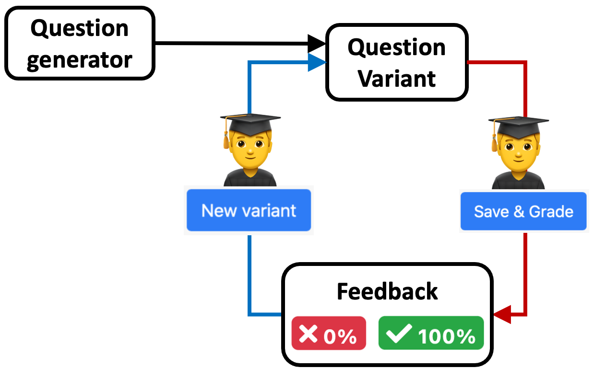
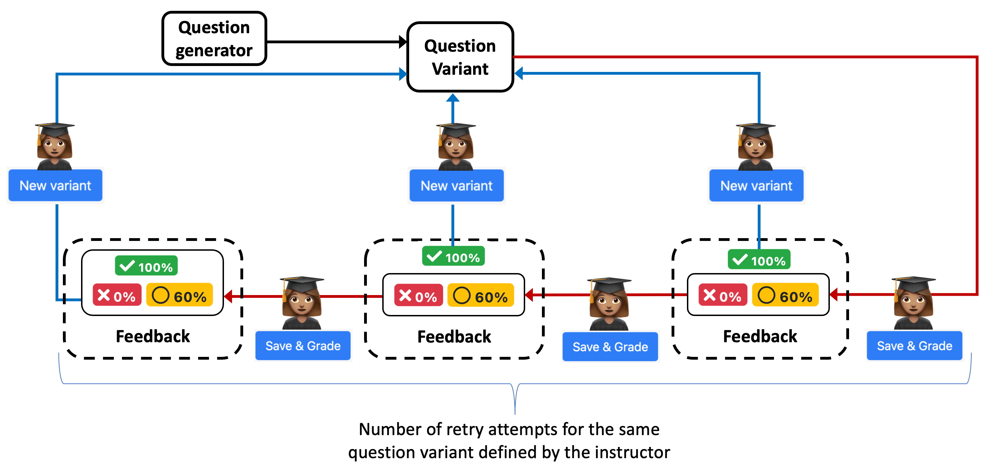
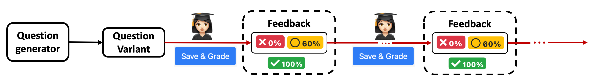

## Homework based on mastery skill

Educational research and learning theory show that small numbers of single-practice problems may not be the most effective learning strategy for students. Mastery learning theory shows that different students require different amounts of practice to achieve proficiency in a given skill, and that all students require repeated practice. In addition, different learning skills require different learning approaches. 

In the following text, we will illustrate how PrairieLearn can be used to create different learning experiences to students, and how they can be adjusted based on the learning goals. We often use these homework as formative assessments, where students receive immediate feedback and have the opportunity to *use* the feedback to enhance their learning.

PrairieLearn supports the development of **question generators**, defined by a set of hmlt and python code that generate different question variants based on randomized parameters. A homework is defined by a collection of question generators.

### Drilling basic skills with unlimited variants

In this configuration, the question generator creates unlimited question variants, each one with a single attempt. Once a student submits an answer to the question, they receive immediate feedback, indicating if the question is correct, partially correct, or incorrect. The feedback may also include more detailed explanation. No matter if a submission is correct or not, students have the ability to generate another variant of the question for another single attempt. Moreover, students are not penalized when submitting an incorrect attempt.

 </img>

 Instructors can define how many times a student needs to correctly submit a question variant. Even after students achieve all the points for a given question, they can continue to work on other question variants for practice. We see students coming back to homework assessments for more practice when reviewing for exams.

Skill levels such as "Remembering", "Understanding" and "Applying" from the Bloom's Taxonomy often require repeated practice until mastery is achieved. Question generators based on these skill levels are good examples for this configuration with unlimited variants:

**Question 1** from [Homework 1](https://www.prairielearn.org/pl/course_instance/128605/assessment/2310476Select) asks students to demonstrate basic thinking and remembering skills, by asking them to select the numbers that are prime (or odd, or even, etc). Students need to successully complete at least 3 question variants in order to receive full credit. 

**Question 2** from [Homework 1](https://www.prairielearn.org/pl/course_instance/128605/assessment/2310476Select) asks students to demonstrate their understanding of binary and decimal numbers, by asking them to convert a decimal number to its binary representation. Students need to successully complete at least 2 question variants in order to receive full credit. 

**Question 3** from [Homework 1](https://www.prairielearn.org/pl/course_instance/128605/assessment/2310476Select) asks students to apply knowledge of derivatives to compute first first order derivatives of polynomial equations. They need to successully complete at least 3 question variants in order to receive full credit. 

### Limiting the number of attempts per variant

 </img>

**Question 4** from [Homework 1](https://www.prairielearn.org/pl/course_instance/128605/assessment/2310476Select) asks students to illustrate a vector with given position and orientation. Each question variant has two attempts, allowing students to retry the same question before generaring a new variant. In this example, students may have the correct understanding of the question, but potentially count the position incorrectly, or miss the correct orientation. The second attempt gives students the opportunity to adjust their thinking, without having to start from the beginning. They need to successully complete at least 2 question variants in order to receive full credit. 

**Question 5** from [Homework 1](https://www.prairielearn.org/pl/course_instance/128605/assessment/2310476Select) asks students to compute a quantity (stress) based on information obtained from a table that is randomized for each question variant. The computation of the stress involves more than one step, from gathering the correct information from the table, and then performing mathematical operations based on known equations. In these situations where students may make small mistakes during the solution process, it may be beneficial to provide more than one attempt for each question variant. 
Here students are given 3 retry attempts for each question variant, and they need to successully complete at least 2 question variants in order to receive full credit. 

### Single variant with unlimited attempts

In some situations you may want students to receive a single question variant with unlimited attempts. This can be desirable when the question involves a lot of computation, or specialized coding.

 </img>

**Question 7** from [Homework 1](https://www.prairielearn.org/pl/course_instance/128605/assessment/2310476Select) students need to apply knowledge from a given topic to contruct the solution to a "real-world" problem. Students have unlimited attempts to submit the correct solution once to receive full credit.

