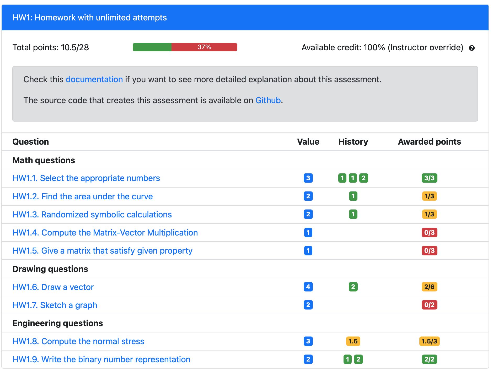
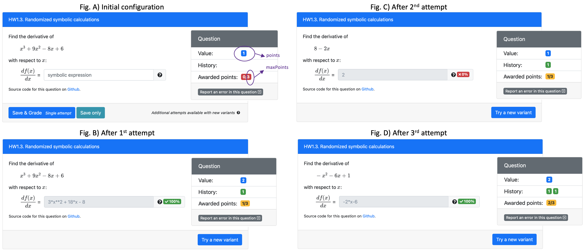
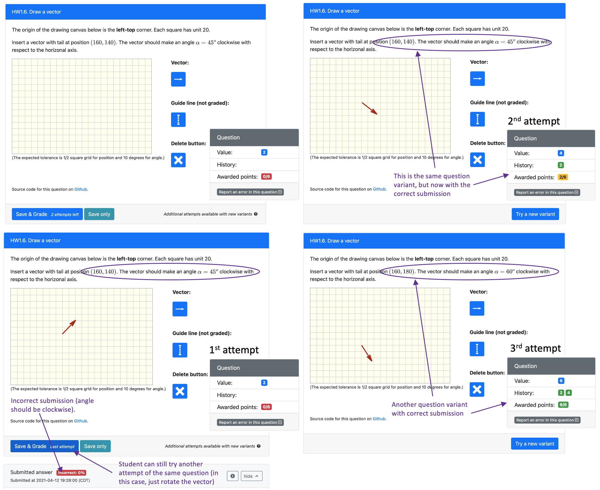
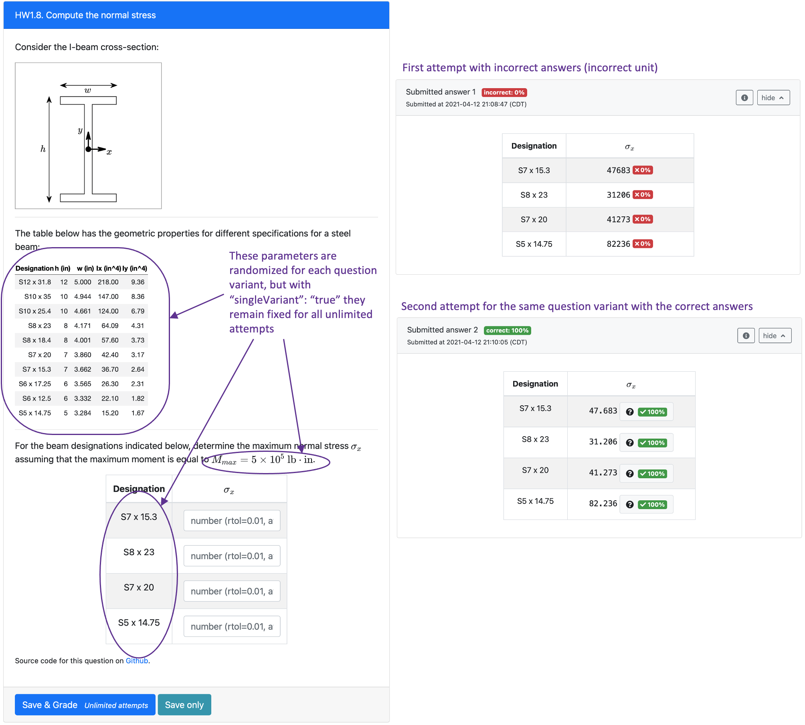
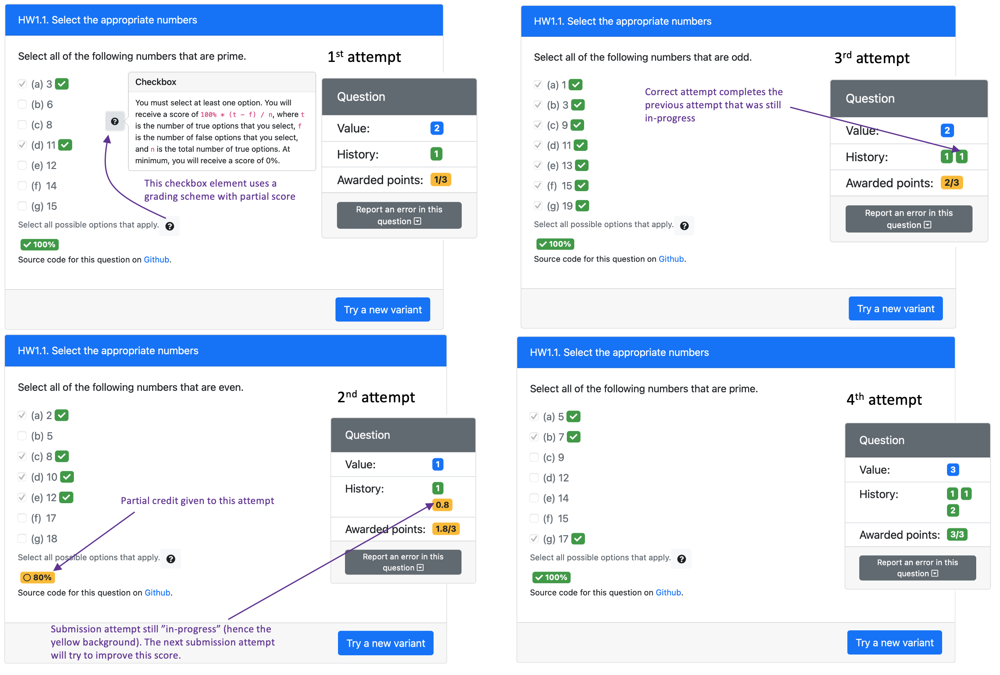

## Homework with unlimited attempts

This assessment provides an example of how we can use PrairieLearn to deliver homework based on a mastery skill approach, where students need to correctly answer different question variants to achieve 100% score. 



This homework setup is achieved using `"type": "Homework"` in the assessment configuration file. The example source code is available on [Github](https://github.com/PrairieLearn/pl-demo-course/blob/master/courseInstances/SectionA/assessments/04-Homework/infoAssessment.json).

### 1) Unlimited variants with single attempts

Using the default settings for `"type": "Homework"`, students 
will be presented with an unlimited number of attempts for each question. where every new attempt corresponds to a different variant of the question (i.e., one single attempt per question variant). We will use Question 3 in this assessment to illustrate this setup. The question is added to the configuration file [(infoAssessment.json)](https://github.com/PrairieLearn/pl-demo-course/blob/master/courseInstances/SectionA/assessments/04-Homework/infoAssessment.json) using the following syntax:

```json
{"id": "General/mathFunctionDerivative", "points": 1,"maxPoints": 3},
```

Before the first submission attempt, the question value is defined by `points`. Note from the initial configuration (Fig. A) that the question has `Value: 1` and `Awarded points: 0/3` where `3` is defined by `maxPoints`. The polynomial function provided to students is generated based on randomized coefficients. In this example, the first attempt was completed successfully (Fig. B), resulting in `Awarded points: 1/3`. For each correct attempt, the question value is updated using `Value = Value + points`, and hence now `Value: 2`.



Students can now generate another variant of the question using the `Try a new variant` button. Note from Fig. C that the new function has different coefficients. 
A successful submission of this second attempt would yield in `Awarded points: 3/3` or 100% credit for that question, in this case showing the student achieved mastery of that concept. In our example, this second attempt was not correct, and hence the total awarded points was not updated. Note that students are not penalized for incorrect answers by losing awarded points. However, the question value gets reset to the original value defined by `points`. For the next attempt, now the question has `Value: 1`. 

Fig. D shows the result from the 3rd attempt for a different question variant. Since the answer is correct, awarded points is updated to `2/3` and the next question attempt has `Value: 2`. Another correct attempt for a different question variant would give the student 100% for that question (3/3). Note that students could continue to generate other question variants for practice, since even incorrect attempts would not affect their earned awarded points. 

### 2) Limiting the number of attempts per variant

There may be some situations where we want students to have more than one attempt for the same question variant. We can use the attribute `triesPerVariant` to control that. We will use 
Question 6 in this assessment to illustrate this setup. The question is added to the configuration file [(infoAssessment.json)](https://github.com/PrairieLearn/pl-demo-course/blob/master/courseInstances/SectionA/assessments/04-Homework/infoAssessment.json) using the following syntax:

```json
{"id": "General/engVectorDrawing", "points": 2, "maxPoints": 6, "triesPerVariant": 2}
```
Note that in this question students can have two attempts for each variant. In the example below, the first attempt for the first question variant is incorrect. The next attempt will have the same question variant (the parameters of the question remain the same). The remaining setup continues the same, with the question value reset for each incorrect attempt.




### 3) Single variant with unlimited attempts

In other situations you may want students to receive a single question variant with unlimited attempts. This can be desirable when the question involves a lot of computation, or specialized coding. In this case, we can set the question to `"singleVariant": true`. We will use Question 8 in this assessment to illustrate this setup. The question is added to the configuration file [(infoAssessment.json)](https://github.com/PrairieLearn/pl-demo-course/blob/master/courseInstances/SectionA/assessments/04-Homework/infoAssessment.json) using the following syntax:

```json
{"id": "General/engBeamStress", "points": 3}
```

Note that we omit the attribute `maxPoints`, which sets the question to the default value where `maxPoints = points`. This setup is more appropriate for questions with a single variant, since additional correct attempts in the same question variant is not aiding the student's learning. 



The question is still implemented using randomization of several parameters as illustrated in the figure above, so that different students get different versions of the question. 

### 4) Questions with partial credit

Some of the PrairieLearn elements allows for partial credit. We will use Question 1 in this assessment to illustrate how the point system described above works with partial credit questions. The question is added to the configuration file [(infoAssessment.json)](https://github.com/PrairieLearn/pl-demo-course/blob/master/courseInstances/SectionA/assessments/04-Homework/infoAssessment.json) using the following syntax:

```json
{"id": "General/mathNumbersConcept-all", "points": 1,"maxPoints": 3}
```



In this example, for the first question variant all the checkboxes are marked correctly, and hence the awarded points is increased by the question value. For the following question variant, one of the correct checkboxes is left unmarked, and hence the score for that question is set to 0.8. Note that this submission attempt is still in-progress, and the next submission will try to improve that score, which will only be updated if greater than 0.8. This point system is designed to stop students from achieving full credit in a given question by just submitting many partially correct question variants.