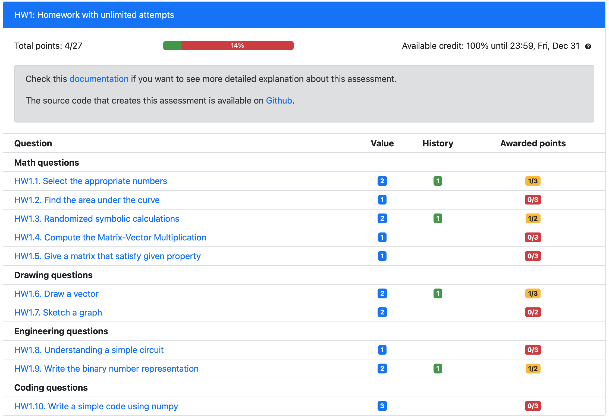
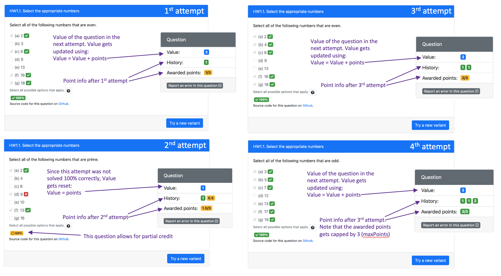

## Homework with unlimited attempts

This assessment provides an example of how we can use PrairieLearn to deliver homework based on a mastery skill approach, where students need to correctly answer different question variants to achieve 100% score. 



[Source code on Github](https://github.com/PrairieLearn/pl-demo-course/tree/master/questions/LectureVelocity/1-Introduction)

#### Question points

Let's take a look at some of the questions and how the points are calculated.

1. HW1.1. Select the appropriate numbers

The question is added to the assessment using the following sintax in the infoAssessment.json file:

```json
{"id": "General/mathNumbersConcept-all", "points": 1,"maxPoints": 3},
```

