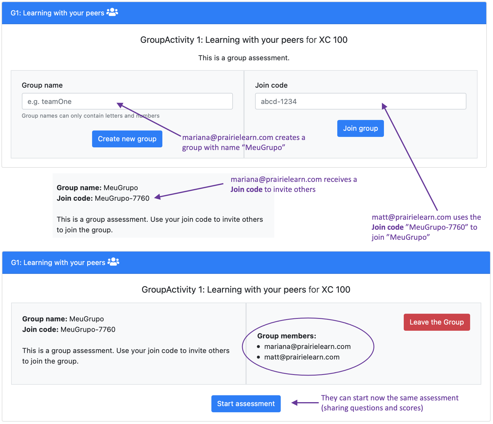
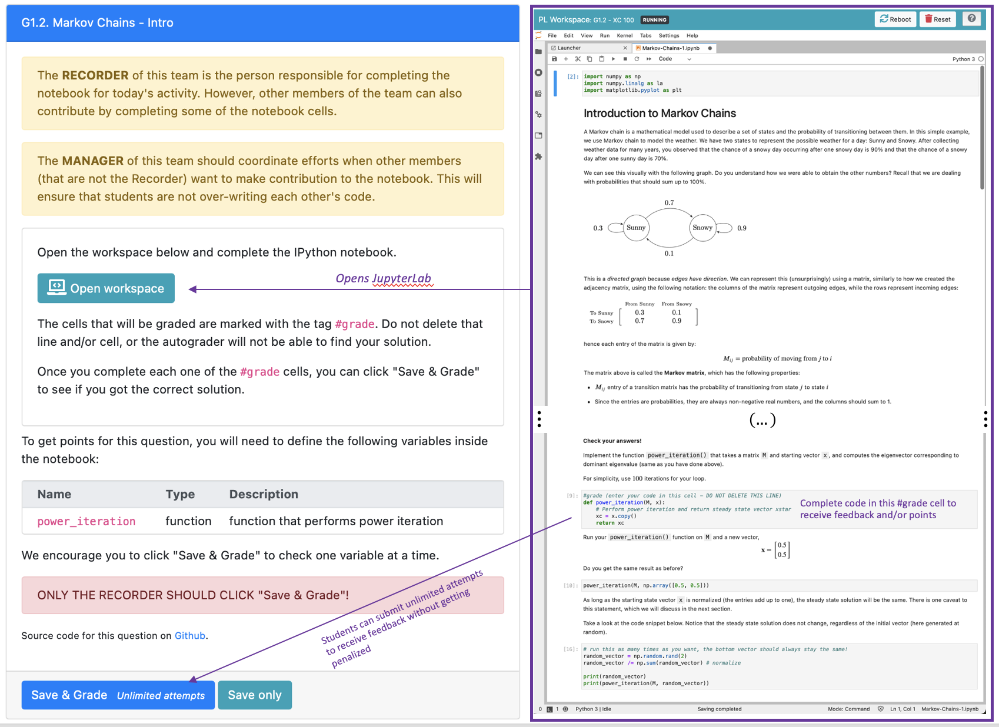

## Group Activities

This assessment provides an example of how we can use PrairieLearn to deliver group activities, in which every student in the same group shares the same questions. 

The setup for this assessment uses `"type": "Homework"` and `"groupWork": true` in the [assessment configuration file](https://github.com/PrairieLearn/pl-demo-course/blob/master/courseInstances/SectionA/assessments/07-GroupWork/infoAssessment.json).

By default, PrairieLearn expects that instructors will assign students to groups prior to the activity. This can be achieved in three different ways: 1) uploading a CSV file with the group information; 2) using a randomized assigment; and 3) copying group assignments from other assessments (see [documentation]() for more information). For this demo assessment, we use the configuration where students can create their own teams, by defining the following properties in the assessment configuration file. 

```json
"groupMinSize": 1,
"groupMaxSize": 5,
"studentGroupCreate": true,
"studentGroupJoin": true,
"studentGroupLeave": true,
```
In this example, students can create, join and leave groups without instructors' permission. In a typical group activity, we often set `groupMinSize >= 2`, however for this demo we set the minium size to 1, so that users interested in exploring this group activity can start the assessment on their own. The image below illustrates how groups can be created by the students.




### Using JupyterLabs with instant feedback

In this group activity, students will complete JupyterLab notebooks, where one can include text, images, and equations for content presentation, and also ask students to perform computations (in this example, using a Python 3 Kernel). Instructors can define `#grade` cells, which are auto-graded for instant feedback. 



Students in the same group will share the same JupyterLab, and the same submission history and scores. Currently the JupyterLab syncs when the document is saved (real-time synchronization is a work-in-progress).